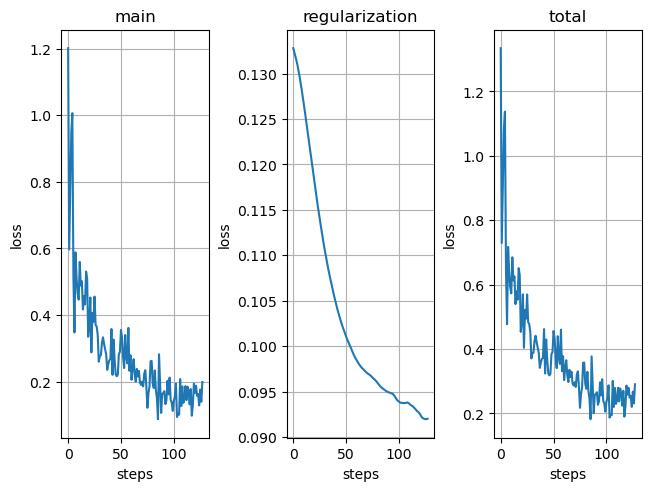
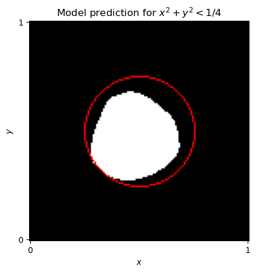
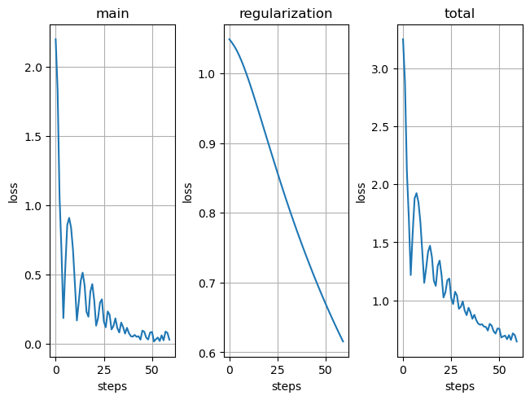
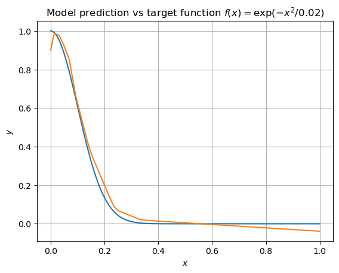

# Matchstick: Yet Another Backprop Implementation

A lightweight implementation of backpropagation for simple neural network architectures. It is a didactic implementation that should help to better understand the backpropagation algorithm. In no way is this intended as production code.

The `matchstick` package currently supports the following building blocks
- linear layers with or without relu activation
- simple loss functions
  - cross entropy loss for classification tasks
  - l1 loss for regression tasks
- sequential composition of layers
- two common optimizers: SGD (with momentum) and Adam

## Installation

I have not added a `setup.py` file. However, it is very easy to use the code as an importable package. Just add the root folder of your local copy of the repository to the Python path:
```
$ export PYTHONPATH="${PYTHONPATH}:/path/to/repo"
```
The dependencies are minimal. Python3 (preferably >= 3.8) is required with numpy. For visualizations or to run the examples matplotlib and pillow are also needed.

## Usage

Once the package is installed or the repository root directory is added to the python path, `matchstick` can be imported. Sample code can be found in the _examples_ folder.

## Results

### Classification

In the [examples/example_classification.py](examples/example_classification.py) script, we train a simple model to learn a binary classification problem with nonlinear decision boundary. More precisely, over the two-dimensional space [0,1]<sup>2</sup>, we try to learn the following function: y=1 if the distance to the center (0.5, 0.5) is less than 1/4 and y=0 otherwise. The results, i.e., the loss curves, as well as the predictions of the model can be seen below.

 
### Regression

In the example [examples/example_regression.py](examples/example_regression.py), we show how the modules of the package can be used to solve a simple regression problem. 
Again, it is easy to learn the function or overfit on the data. Exceptions are the edges of the domain, where the distance to the target function is the largest. The results can be seen below.

 